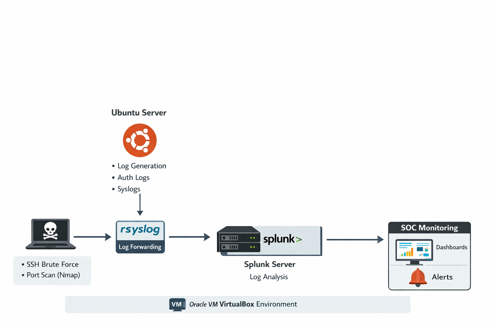

# Splunk SOC Lab – Log Monitoring and Threat Detection

## Project Overview and Objectives

This project demonstrates the implementation of a **centralized log monitoring and security analysis system using Splunk Enterprise**. The system collects logs generated from a Linux server running Ubuntu and analyzes them to detect suspicious activities within the environment.

The primary objective of this project is to show how logs from different sources can be **collected, indexed, and analyzed using a Security Information and Event Management (SIEM) platform**.

The project also focuses on monitoring **authentication logs** to detect suspicious patterns such as repeated failed login attempts, unauthorized access attempts, and abnormal system behavior.

Simulated attack activities such as **SSH login attempts and Nmap port scanning** were performed to generate realistic log data for analysis.

---

## Tools and Technologies Used

- **Splunk Enterprise** – SIEM platform for log collection and analysis
- **Ubuntu** – Linux server used to generate system logs
- **rsyslog** – Log management service used to collect and forward logs
- **OpenSSH** – Used to simulate SSH login attempts
- **Nmap** – Used to simulate port scanning attacks
- **Oracle VM VirtualBox** – Virtualization platform for the lab environment

---

## System Architecture

The project architecture simulates a **Security Operations Center (SOC) monitoring environment**.

An attacker machine performs simulated attacks such as **SSH brute-force attempts and port scanning** against the Ubuntu server. The server generates authentication and system logs, which are collected by the **rsyslog logging service**.

These logs are then forwarded to the **Splunk server**, where they are indexed and analyzed. Splunk processes the log data and displays results through **dashboards and alerts**.

### Architecture Diagram



---

## Implementation

The implementation involved setting up a centralized log monitoring environment using **Splunk Enterprise**.

First, a virtual environment was created using **Oracle VM VirtualBox**, and an Ubuntu virtual machine was installed to generate system and authentication logs.

Next, **Splunk Enterprise** was installed and configured. The Splunk web interface was accessed through port **8000**.

The **rsyslog service** was configured to collect system logs, particularly authentication logs located at:


/var/log/auth.log


These logs were ingested into Splunk and indexed for analysis using **Splunk Search Processing Language (SPL)**.

To simulate attack scenarios, **SSH login attempts and Nmap port scans** were performed.

---

## Detection and Analysis

Security detections were implemented by analyzing logs using **Splunk SPL queries**.

### SSH Brute Force Detection

Multiple failed SSH login attempts were monitored using the query:

```spl
index=main "Failed password"

Port Scan Detection

Port scanning activity generated using Nmap was analyzed in Splunk.

Privilege Escalation Monitoring

Sudo activity was monitored using the query:

index=main "sudo: pam_unix(sudo:session): session opened for user"

```

## Results and Findings

The implementation successfully demonstrated how **centralized log monitoring using Splunk** can help detect suspicious activities.

The system was able to identify:

- **Multiple failed SSH login attempts**
- **Potential brute-force attack patterns**
- **Port scanning activities**
- **Authentication trends and source IP addresses**

Splunk dashboards provided visual insights into system activity, while alerts notified administrators when suspicious behavior was detected.

---

## Lessons Learned

This project provided practical experience in **log monitoring, threat detection, and SIEM implementation**.

### Key Learnings

- Understanding centralized log management using **Splunk Enterprise**
- Configuring **rsyslog** for log collection
- Analyzing logs using **Splunk SPL**
- Detecting security threats such as **brute-force attacks and port scanning**
- Creating **dashboards and alerts** for security monitoring

---

## Future Improvements

Possible improvements include:

- Integrating additional log sources such as **firewall logs and web server logs**
- Creating more advanced **correlation rules**
- Improving **dashboards and visualizations**
- Adding **automated incident response mechanisms**
- Expanding the environment to include **multiple monitored servers**

---

## Conclusion

This project demonstrates how a **SIEM platform such as Splunk Enterprise** can be used to implement centralized log monitoring and detect potential security threats.

By analyzing logs generated from a **Linux server**, the system successfully detected suspicious activities such as **failed login attempts and port scanning behavior**.

Overall, the project highlights the importance of **log monitoring and SIEM technologies in modern Security Operations Center (SOC) environments**.
